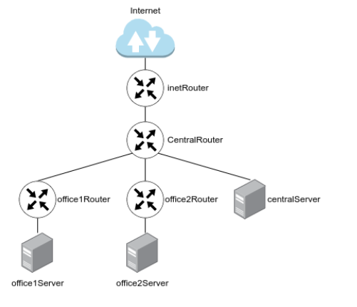
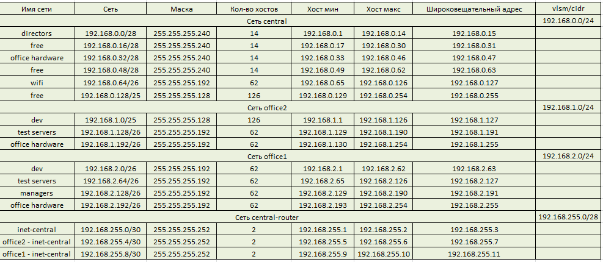
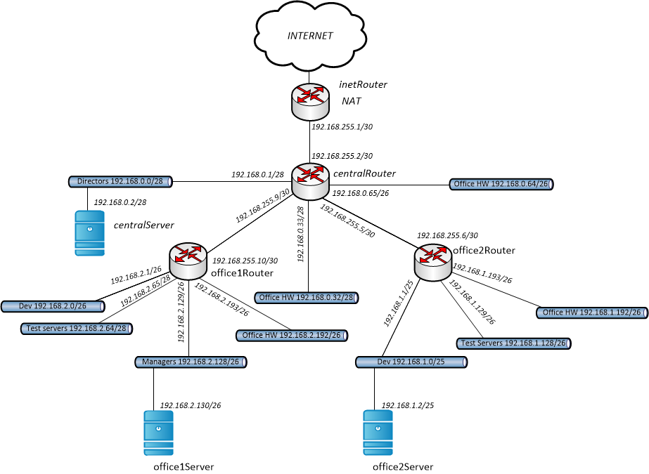
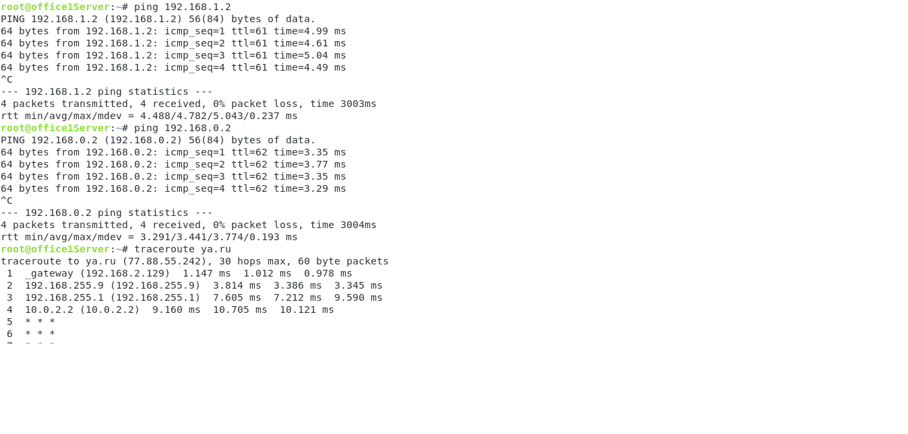

# Домашняя работа: Vagrant-стенд с сетевой лабораторией


	Цель работы: Научится менять базовые сетевые настройки в Linux-based системах.
	
	Описание домашнего задания
   1. Скачать и развернуть Vagrant-стенд https://github.com/erlong15/otus-linux/tree/network
   2. Построить следующую сетевую архитектуру:
   Сеть office1
   - 192.168.2.0/26      - dev
   - 192.168.2.64/26     - test servers
   - 192.168.2.128/26    - managers
   - 192.168.2.192/26    - office hardware

   Сеть office2
   - 192.168.1.0/25      - dev
   - 192.168.1.128/26    - test servers
   - 192.168.1.192/26    - office hardware

   Сеть central
   - 192.168.0.0/28     - directors
   - 192.168.0.32/28    - office hardware
   - 192.168.0.64/26    - wifi
   
   


	Что нужно сделать?

	1. Теоретическая часть
    - Найти свободные подсети
    - Посчитать количество узлов в каждой подсети, включая свободные
    - Указать Broadcast-адрес для каждой подсети
    - Проверить, нет ли ошибок при разбиении
	
    2. Практическая часть
	- Соединить офисы в сеть согласно логической схеме и настроить роутинг
	- Интернет-трафик со всех серверов должен ходить через inetRouter
	- Все сервера должны видеть друг друга (должен проходить ping)
	- У всех новых серверов отключить дефолт на NAT (eth0), который vagrant поднимает для связи
    - Добавить дополнительные сетевые интерфейсы, если потребуется
	
	Рекомендуется использовать Vagrant + Ansible для настройки данной схемы.
	
	
# Выполнение:
  
1. Теоретическая часть
	
Найти свободные подсети и подсчитать в количество устройств в каждой подсети, включая свободные и указать broadcast-адрес для каждой подсети.
	
Рассчитаем количество устройств по формуле: 2^(32-mask)-2.
Для сети "directors" количество устройств будет равно: 2^(32-28)-2 = 14.
Следующая подсеть - свободная (192.168.0.16/28), адрес сети будет равен 192.168.0.16, Broadcast-адрес - 192.168.0.31.
Рассчитаем каждую подсеть и сведём всё в таблицу, для связи маршрутизаторов офисов с центральным маршрутизатором введём две подсети с 30-й маской.
    


2. Практическая часть	
	
На основании таблицы построим полную схему сети:
	

	
	
# Интернет-трафик со всех серверов должен ходить через inetRouter
	
Отключаем дефолтный шлюз по умолчанию и настраиваем новый шлюз на всех серверах кроме inetRouter:
	
centralRouter - 192.168.255.1;
office1Router - 192.168.255.9;
office2Router - 192.168.255.5;
centralServer - 192.168.0.1;
office1Server - 192.168.2.129;
office1Server - 192.168.1.1.
	
Пример настройки шлюза в файле "00-installer-config.yaml" для сервера centralRouter:
````
 network:
  ethernets:
    eth0:
      dhcp4: true
      dhcp4-overrides:
          use-routes: false
      dhcp6: false
    eth1:
      routes: 
       - to: default
         via: 192.168.255.1
      mtu: 1500
  version: 2
 ````

Отключаем ufw и включаем передачу транзитных пакетов для серверов inetRouter;centralRouter;office1Router;office2Router.
Пример настройки представлен на примере плейбука для сервера centralRouter:

````
  tasks:
    - name: stop ufw
      become: yes
      become_user: root
      systemd:
        name: ufw
        state: stopped
        enabled: no

    - name: update
      apt:
        update_cache=yes
      tags:
        - update apt

    - name: install traceroute on ubuntu
      apt:
        name:
          - traceroute
        state: present
        update_cache: true

    - name: set up forward packages across routers
      sysctl:
        name: net.ipv4.conf.all.forwarding
        value: '1'
        state: present
      when: "'routers' in group_names"
 ````
Добавляем обратные маршруты на сервере inetRouter для сетей:
central - 192.168.0.0/24;
central-router - 192.168.255.0/28;
office1 - 192.168.0.2/24;
office2 - 192.168.0.1/24.

Пример добавления обратных маршрутов в файле "50-vagrant.yaml" для сервера inetRouter:

````
---
network:
  version: 2
  renderer: networkd
  ethernets:
    eth1:
      addresses:
      - 192.168.255.1/30
      routes:
       - to: 192.168.0.0/24
         via: 192.168.255.2
       - to: 192.168.1.0/24
         via: 192.168.255.2
       - to: 192.168.2.0
         via: 192.168.255.2
       - to: 192.168.255.0/28
         via: 192.168.255.2
    eth2:
      addresses:
      - 192.168.56.10/24
```
Для выхода в Интернет всех подсетей включаем NAT на сервере inetRouter, фаил "iptables_rules.ipv4":

```
*filter
:INPUT ACCEPT [90:8713]
:FORWARD ACCEPT [0:0]
:OUTPUT ACCEPT [54:7429]
-A INPUT -p icmp -j ACCEPT
-A INPUT -i lo -j ACCEPT
-A INPUT -p tcp -m state --state NEW -m tcp --dport 22 -j ACCEPT
COMMIT
# Completed on Sat Oct 14 16:14:36 2023
# Generated by iptables-save v1.8.7 on Sat Oct 14 16:14:36 2023
*nat
:PREROUTING ACCEPT [1:44]
:INPUT ACCEPT [1:44]
:OUTPUT ACCEPT [0:0]
:POSTROUTING ACCEPT [0:0]
-A POSTROUTING ! -d 192.168.0.0/16 -o eth0 -j MASQUERADE
COMMIT
````
Создаем скрипт востановления правил после перезагрузки, в файле "iptables_restore":
   
````
 #!/bin/sh
/sbin/iptables-restore < /etc/iptables_rules.ipv4
````
# Соединить офисы в сеть согласно логической схемы и настроить роутинг

Для настройки роутинга между подсетями central-office1-office2 добавим обратные маршруты на сервере centralRouter, в 
файле 50-vagrant.yaml:

````
---
network:
  version: 2
  renderer: networkd
  ethernets:
    eth1:
      addresses:
      - 192.168.255.2/30
    eth2:
      addresses:
      - 192.168.0.1/28
    eth3:
      addresses:
      - 192.168.0.33/28
    eth4:
      addresses:
      - 192.168.0.65/26
    eth5:
      addresses:
      - 192.168.255.9/30
      routes:
       - to: 192.168.2.0/24
         via: 192.168.255.10
    eth6:
      addresses:
      - 192.168.255.5/30
      routes:
       - to: 192.168.1.0/24
         via: 192.168.255.6
    eth7:
      addresses:
      - 192.168.56.11/24
````
  
Проверим связь с серверами офисов и произведем трассировку до ya.ru с сервера office1Server:

	

	
Как видим, третий хоп это шлюз сервера inetRouter. Задание выполнено.
	
	
	
	
	
	
	
	


